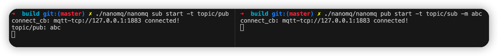

# ZMQ GATEWAY

## Compile
Gateway tool isn't built by default, you can enable it via -DBUILD_ZMQ_GATEWAY=ON.

```
cmake -G Ninja -DBUILD_ZMQ_GATEWAY=ON ..
ninja
```
Now we run command `nanomq` will get output below:
```
available applications:
   * broker
   * pub
   * sub
   * conn
   * nngproxy
   * nngcat
   * gateway

NanoMQ  Edge Computing Kit & Messaging bus v0.6.8-3
Copyright 2022 EMQ X Edge Team
```
It's show that gateway is ok now. 

## Run
Run command `nanomq gateway` or `nanomq gateway --help` will get:
```
Usage: nanomq gateway start [--conf <path>]

  --conf <path>  The path of a specified nanomq configuration file 
```
The output indicate that gateway need a configure file.

### Confiure file
Here is a configure file template.
```
##====================================================================
## Configuration for MQTT ZeroMQ Gateway
##====================================================================

## MQTT Broker address: host:port .
##
## Value: String
## Example: mqtt-tcp://127.0.0.1:1883
gateway.mqtt.address=mqtt-tcp://broker.emqx.io:1883

## ZeroMQ Subscribe address: host:port .
##
## Value: String
## Example: tcp://127.0.0.1:5560
gateway.zmq.sub.address=tcp://127.0.0.1:5560

## ZeroMQ Publish address: host:port .
##
## Value: String
## Example: tcp://127.0.0.1:5559
gateway.zmq.pub.address=tcp://127.0.0.1:5559

## ZeroMQ subscription prefix
##
## Value: String
## Example: sub_prefix
## gateway.zmq.sub_pre=sub_prefix

## ZeroMQ publish prefix
##
## Value: String
## Example: pub_prefix
## gateway.zmq.sub_pre=pub_prefix

## Need to subscribe to remote broker topics
##
## Value: String
gateway.mqtt.subscription.topic=topic/sub

## Protocol version of the mqtt client.
##
## Value: Enum
## - 5: mqttv5
## - 4: mqttv4
## - 3: mqttv3
gateway.mqtt.proto_ver=4

## Ping interval of a down mqtt client.
##
## Value: Duration
## Default: 10 seconds
gateway.mqtt.keepalive=60

## The Clean start flag of mqtt client.
##
## Value: boolean
## Default: true
##
## NOTE: Some IoT platforms require clean_start
##       must be set to 'true'
gateway.mqtt.clean_start=true

## The username for mqtt client.
##
## Value: String
gateway.mqtt.username=username

## The password for mqtt client.
##
## Value: String
gateway.mqtt.password=passwd

## Topics that need to be forward to IoTHUB
##
## Value: String
## Example: topic1/pub
gateway.mqtt.forward=topic/pub

## Need to subscribe to remote broker topics
##
## Value: String
gateway.mqtt.subscription=topic/sub

## parallel
## Handle a specified maximum number of outstanding requests
##
## Value: 1-infinity
gateway.mqtt.parallel=2
```
Configure file description can find [here](./config-description.md).

### ZMQ server
Here is a zmq_echo_server.c, It will send back by another port when it receive a message.
```
#include "zmq.h"

int main (void)
{
  //  Socket to receive messages on
  void *context = zmq_ctx_new ();

  //  Socket for control input
  void *controller = zmq_socket (context, ZMQ_SUB);
  void *sender = zmq_socket (context, ZMQ_PUB);
  // zmq_connect (controller, "tcp://localhost:5559");
  zmq_bind(controller, "tcp://*:5559");
  zmq_bind(sender, "tcp://*:5560");
  zmq_setsockopt (controller, ZMQ_SUBSCRIBE, "", 0);

  //  Process messages from either socket
  while (1) {

    zmq_msg_t message;
    zmq_msg_init(&message);
    zmq_msg_recv(&message, controller, 0);
    int more = zmq_msg_more (&message);
    printf("recv: %.*s\n", (int) zmq_msg_size(&message), (char*) zmq_msg_data(&message));
    int size = zmq_send(sender, zmq_msg_data(&message), zmq_msg_size(&message), 0);

    zmq_msg_close (&message);

  }
  zmq_close (controller);
  zmq_ctx_destroy (context);
  return 0;
}
```
You can compile it by `gcc zmq_echo_server.c -o zmq_echo_server -lzmq`, Make sure you have 
installed libzmq before compile it.

Launch broker and zmq server, then launch nanomq gateway 
```
$ nanomq broker start
$ ./zmq_echo_server
$ nanomq gateway start --conf path/to/nanomq_gateway.conf
```

We can first subscribe topic `topic/sub` by a client, then publish topic `topic/pub` by another 
client, like below:
```
$ nanomq sub start -t topic/pub
$ nanomq pub start -t topic/sub -m abc
```


